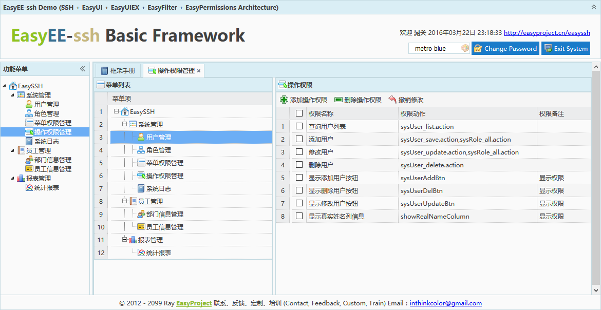

# EasyEE 开源 JavaEE 企业快速开发平台

EasyEE 是一个开源 JaveEE 企业快速开发基础平台。

整合了广泛使用的 JaveEE 领域优秀框架及 EasyUI 前端框架；提供了基于用户、角色、权限方案的后台权限管理系统，安全管理框架及常用开发组件。为企业级项目开发提供了基础架构和规范。

EasyEE is an open source JaveEE enterprise rapid development of the basic platform.

It integrates the widely used framework of JaveEE domain and EasyUI front-end framework. It provides the back-end rights management system, security management framework and common development components based on user, role and permission scheme. Provides infrastructure and specifications for enterprise-level project development.

Least version: `3.0.0-RELEASE`

## EasyEE Releases/EasyEE 发行版本

根据喜好，提供可供选择的多种技术框架组合。

Provide a variety of technical framework combinations.

- **EasyEE-SSH**: `Spring` + `Struts` + `Hibernate`

- **EasyEE-SH**: `SpringMVC` + `Hibernate`

- **EasyEE-SM**: `SpringMVC` + `MyBatis`

### EasyEE-SSH(JPA) 3.0.0
---------------------------

- **Struts 2.5+**
- **Hibernate 5+(JPA)**
- **Spring 4+**
- **Shiro 2+**
- EasyCommonDAO
- EasyShiro 
- EasyFilter
- EasyUI 1.4.3
- EasyUIEx 2.2.0

#### Develop documentation/开发文档

[中文](3.0.0/doc/SSH/EasyEE-ssh-readme-zh_CN.md)

[English](3.0.0/doc/SSH/EasyEE-ssh-readme-en.md)

### EasyEE-SH(JPA) 3.0.0
---------------------------

- **Spring 4+(SpringMVC)**
- **Hibernate 5+(JPA)**
- **Shiro 2+**
- EasyCommonDAO
- EasyShiro 
- EasyFilter
- EasyUI 1.4.3
- EasyUIEx 2.2.0

#### Develop documentation/开发文档

[中文](3.0.0/doc/SH/EasyEE-sh-readme-zh_CN.md)

[English](3.0.0/doc/SH/EasyEE-sh-readme-en.md)

### EasyEE-SM 3.0.0
---------------------------

- **Spring 4+(SpringMVC)**
- **MyBatis 3.4+**
- **Shiro 2+**
- EasyMyBatis-Pagination
- EasyShiro 
- EasyFilter
- EasyUI 1.4.3
- EasyUIEx 2.2.0

#### Develop documentation/开发文档

[中文](3.0.0/doc/SM/EasyEE-sm-readme-zh_CN.md)

[English](3.0.0/doc/SM/EasyEE-sm-readme-en.md)

## Run/运行 

### 中文

1. 运行环境
 - JDK 7+
 - MySQL 5.7+
 - Maven 3+
 
2. 创建数据库

 执行相应 SQL 脚本  `3.0.0\project\XXX\xxx.sql`
 
3. 编辑 JDBC 数据库连接配置参数

 修改 `src/main/resources/db.properties`

4. 启动
  
 执行 `startup.bat`(`mvn jetty:run`)/`startup.sh` 

5. 访问( jetty HTTP 端口 `9999`)
 
 [http://localhost:9999/](http://localhost:9999/)
 
 最高管理员用户名: `admin`
 
 密码: `admin123`

### English

1. Run Enviroment
 - JDK 7+
 - MySQL 5.7+
 - Maven 3+
 
2. Create database

 execute `3.0.0\project\XXX\xxx.sql`
 
3. Edit jdbc properties

 Edit `src/main/resources/db.properties`

4. Start
  
 Run `startup.bat`(`mvn jetty:run`)/`startup.sh` 

5. Visit( jetty HTTP port `9999`)
 
 [http://localhost:9999/](http://localhost:9999/)
 
 Username: `admin`
 
 Password: `admin123`

## Demo

[Demo Online](http://www.easyproject.cn/easyee-ssh 'Demo')

Username: `demo`

Password: `111111`

## The EasyEE Roadmap

### Planned versions/计划版本

- **EasyEE 4.0.0**: 

 SpringBoot Support

### Other porject support/其他项目工具支持

- **EasyEE Auto 1.2.0**: 

 EasyEE Automated code generator / EasyEE 自动化代码生成器

## Official home/官方主页

### 中文

[官方主页](http://www.easyproject.cn/easyee/zh-cn/index.jsp '官方主页')

[留言评论](http://www.easyproject.cn/easyee/zh-cn/index.jsp#donation '留言评论')

### English

[The official home page](http://www.easyproject.cn/easyee/en/index.jsp 'The official home page')

[Comments](http://www.easyproject.cn/easyee/en/index.jsp#donation 'Comments')

## End

Email：<inthinkcolor@gmail.com>

[http://www.easyproject.cn](http://www.easyproject.cn "EasyProject Home")

**支付宝钱包扫一扫捐助：**

我们相信，每个人的点滴贡献，都将是推动产生更多、更好免费开源产品的一大步。

**感谢慷慨捐助，以支持服务器运行和鼓励更多社区成员。**

</img>

We believe that the contribution of each bit by bit, will be driven to produce more and better free and open source products a big step.

**Thank you donation to support the server running and encourage more community members.**

